Hybrid-PathTracer (macOS Apple Silicon Fork)
=============================================

A physically based path tracer that runs entirely in a GLSL fragment shader — now adapted and enhanced for macOS Apple Silicon and OpenGL 4.1.

Forked from [GLSL-PathTracer by Asif Ali](https://github.com/knightcrawler25/GLSL-PathTracer)

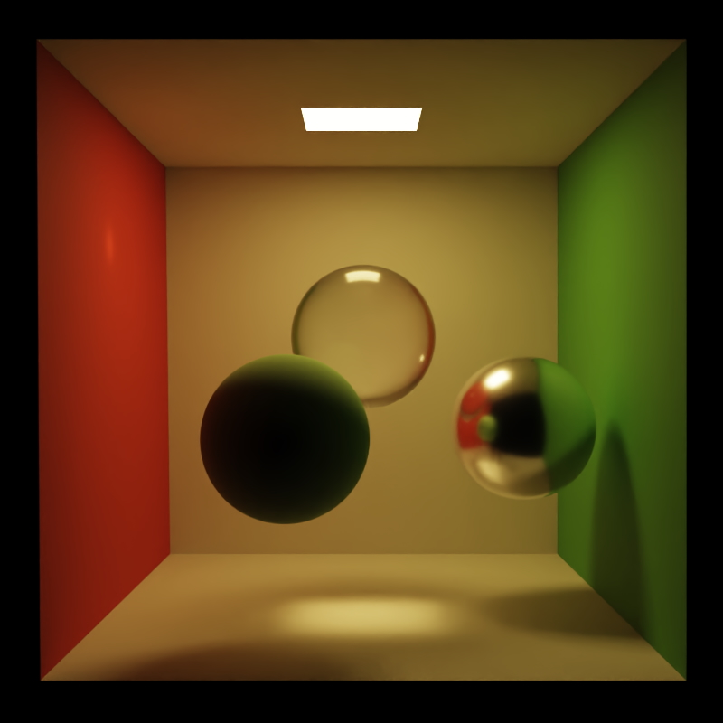

Features
--------
- Physically based unidirectional path tracer
- GLSL 410 Core (OpenGL 4.1 — fully compatible with macOS)
- Two-level BVH acceleration structure with instancing
- Disney BRDF shading model
- Texture support: Albedo, Metallic-Roughness, Normal, Emission
- Image-based lighting (HDR environment maps)
- Analytic lights (Point, Rectangular, Directional)
- Multiple Importance Sampling
- Tile-based rendering system
- OpenImageDenoise integration
- Stochastic alpha masking for transparency
- Homogeneous volumes in MagicaVoxel style
- GLTF/GLB scene loading (WIP)
- Support for macOS M1/M2/M3 via gl3wApple

Build Instructions
--------
Please see INSTALL-MAC.txt. Works in Apple Silicon only. 

Sample Scenes
--------
A couple of sample scenes are provided in the repository. Additional scenes can be downloaded from here:
https://drive.google.com/file/d/1UFMMoVb5uB7WIvCeHOfQ2dCQSxNMXluB/view

Gallery
--------

--------
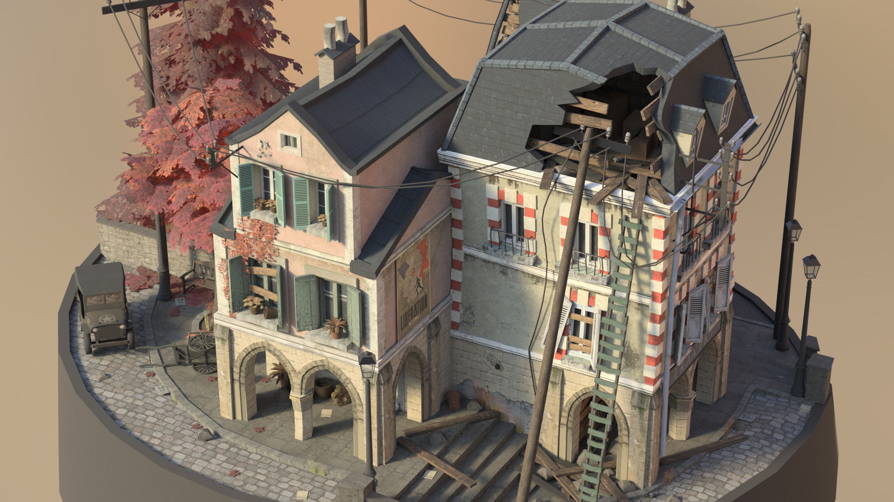
--------
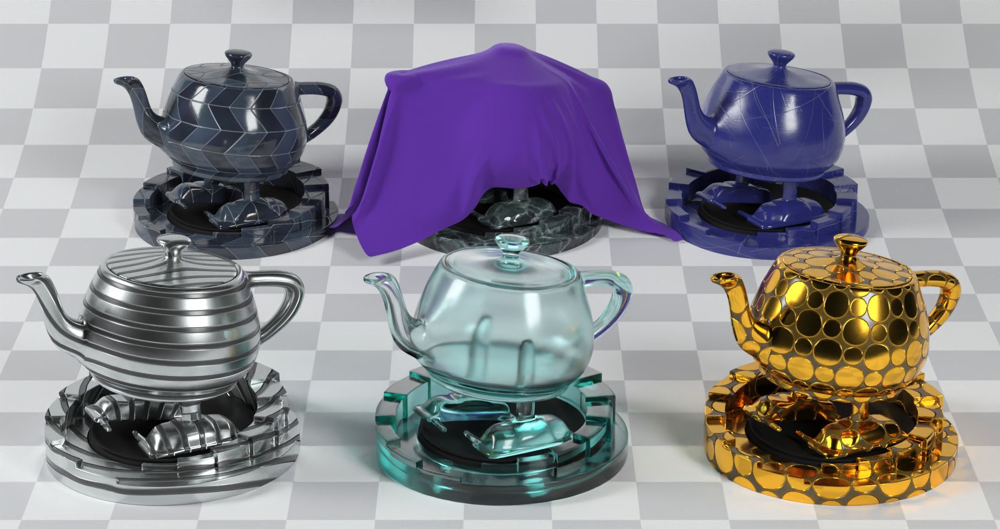
--------
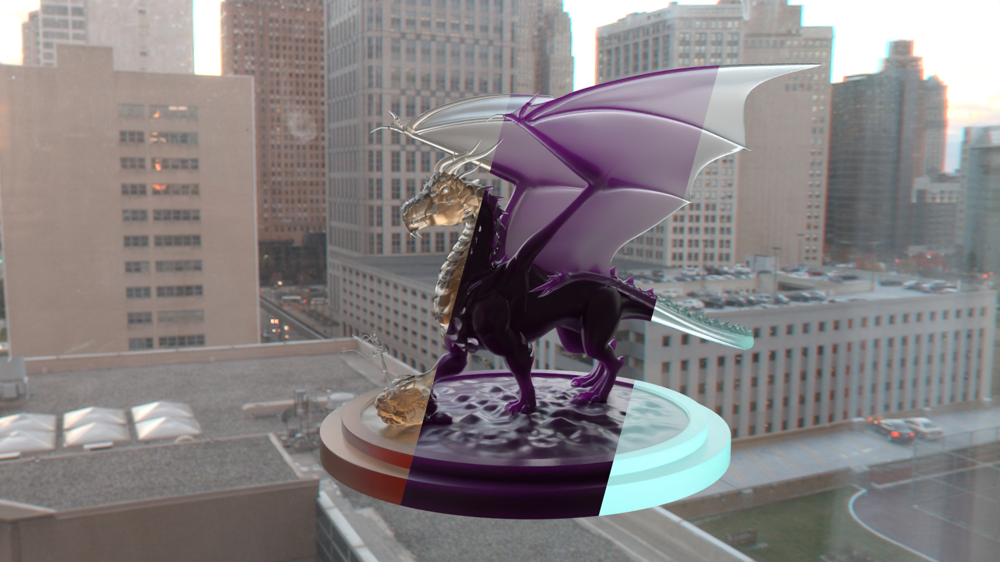
--------
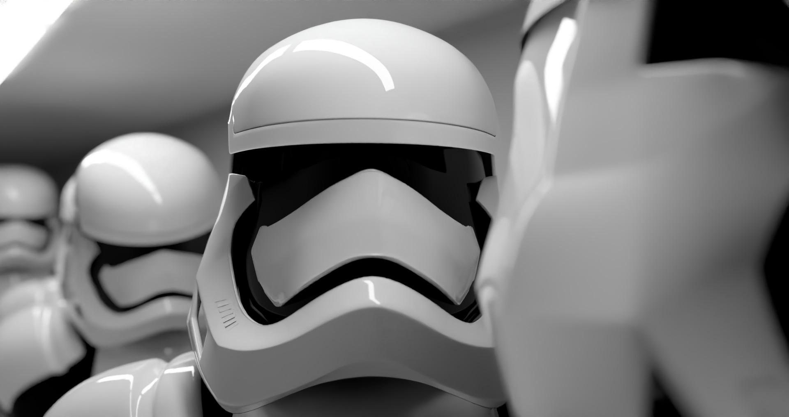
--------
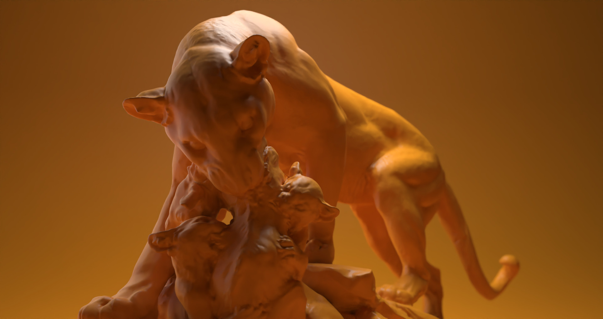
--------
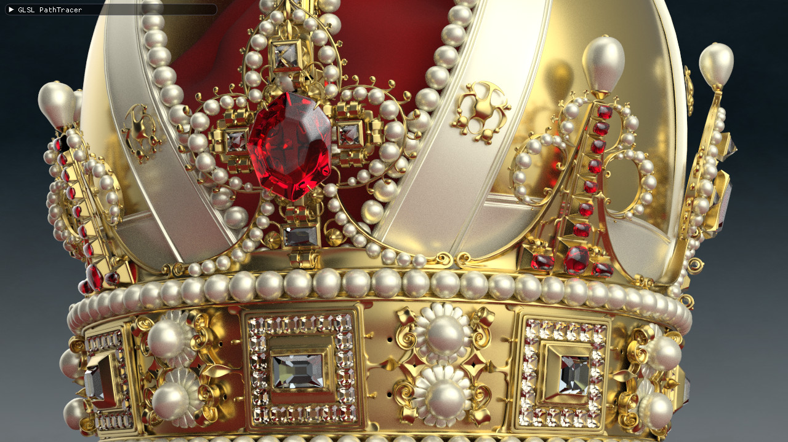
--------

--------
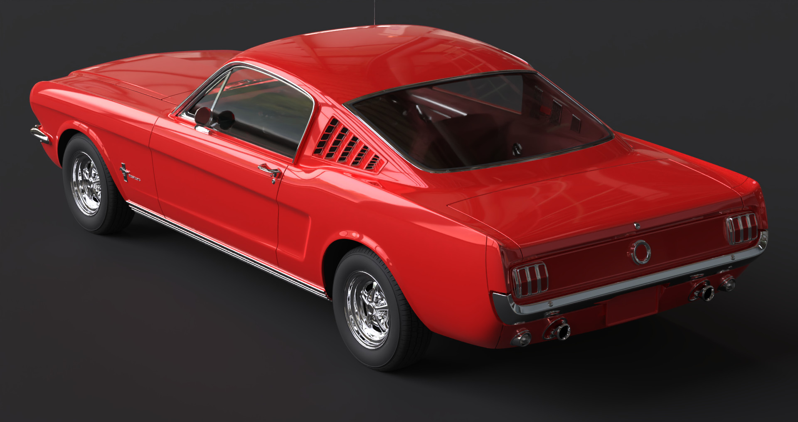
--------
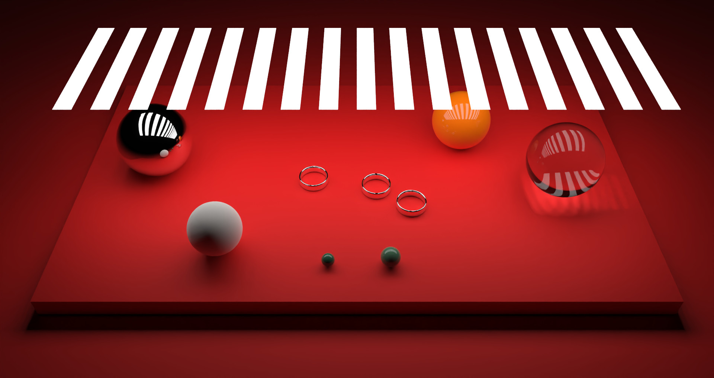
--------
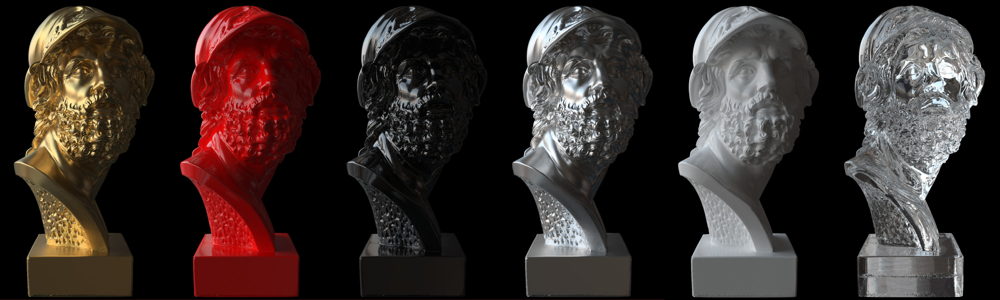
--------
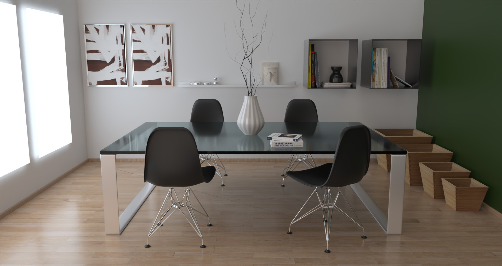
--------
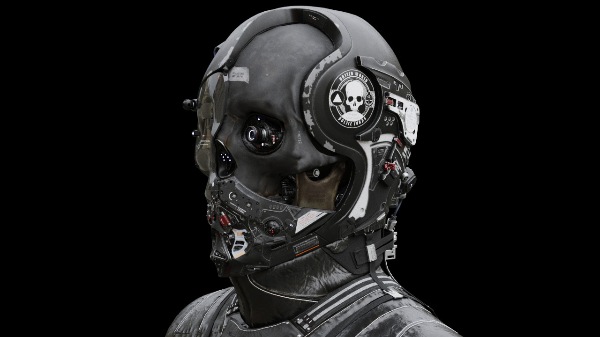
--------
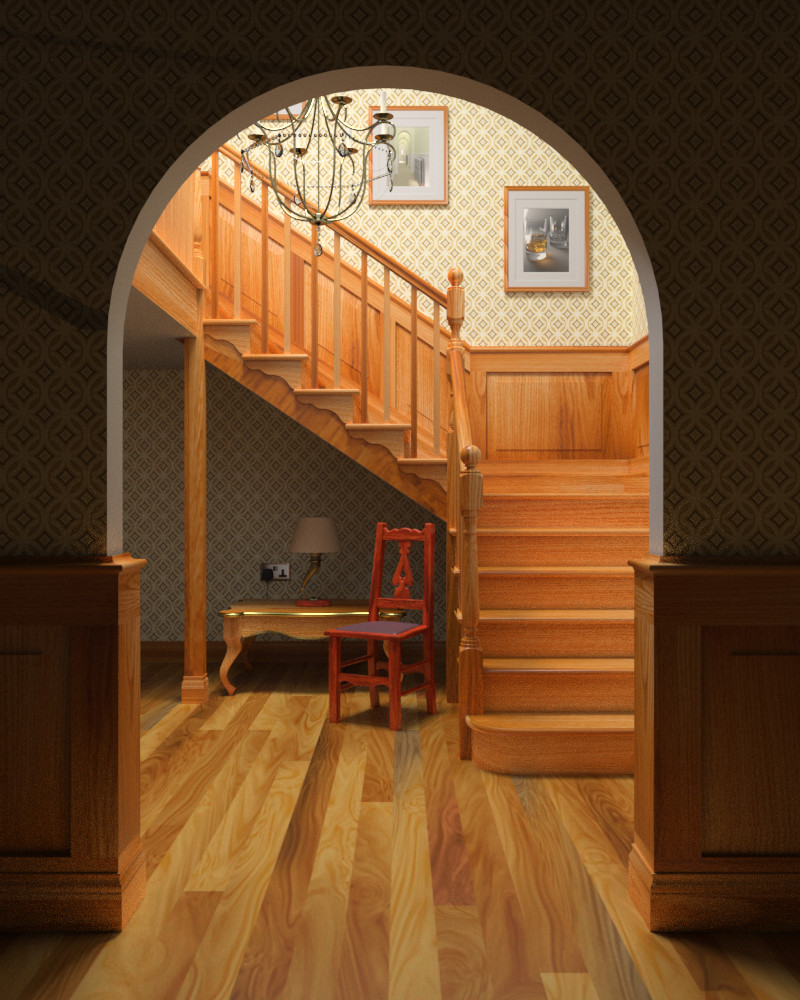
--------
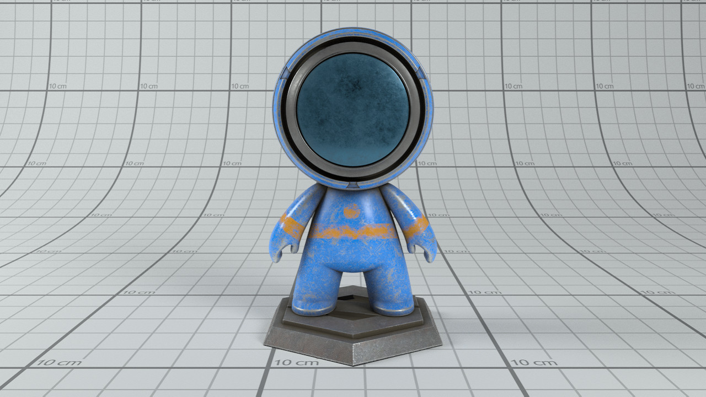

References/Credits
--------

- Asif Ali – [GLSL-PathTracer](https://github.com/knightcrawler25/GLSL-PathTracer) 
- Cedric Guillemet (https://github.com/CedricGuillemet) for cleaning up the code, adding the UI, integrating ImGuizmo, cmake and quite a lot of fixes.
- Tinsel Renderer (https://github.com/mmacklin/tinsel) A modified version of the scene description & loader from that project is used here.
- Ray Tracing in One Weekend (https://github.com/petershirley/raytracinginoneweekend).
- Erich Loftis's THREE.js PathTracer (https://github.com/erichlof/THREE.js-PathTracing-Renderer).
- OptiX Introduction Samples (https://github.com/nvpro-samples/optix_advanced_samples/tree/master/src/optixIntroduction)
- Mitsuba Renderer (https://github.com/mitsuba-renderer/mitsuba) Reference for validation.
- PBRT-v3 (https://github.com/mmp/pbrt-v3).
- Model links/credits are in the assets folder (See: Model Credits.txt)

License 
-------

- Original code copyright (c) 2019 Asif Ali
- macOS Apple Silicon fork and modifications (c) 2025 Dario Pagliaricci
